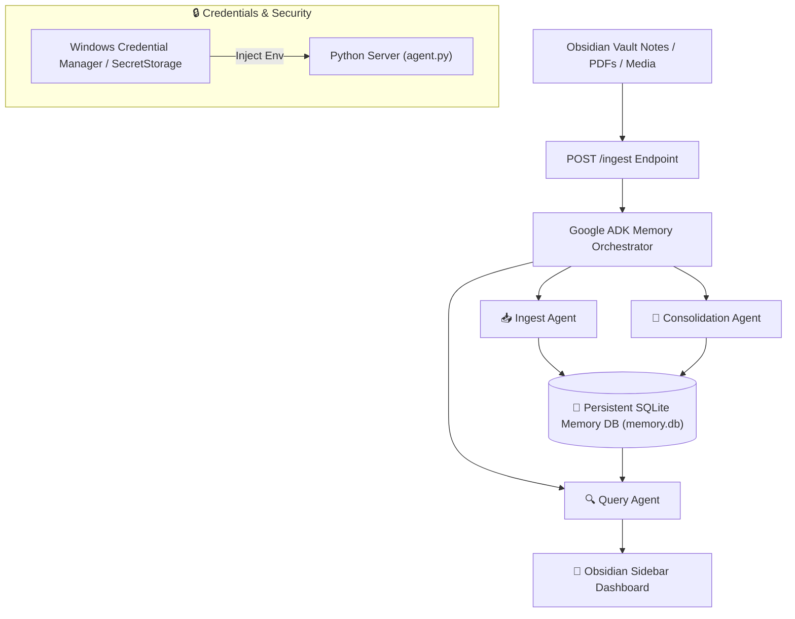

# 🧠 Always-On Memory Agent (Obsidian & Google ADK Integration)

An always-on personal memory and intelligence layer that runs continuously in the background, observing your Obsidian notes, extracting semantic insights, ingesting multimodal assets (PDFs, Images, Audio), and maintaining a persistent, structured SQLite memory bank of knowledge.

> **Attribution & Credits**: This project is a custom Obsidian Desktop plugin implementation adapted from the **Google ADK (Agent Development Kit)** memory architecture samples published in the [Google Cloud Generative AI Repository](https://github.com/GoogleCloudPlatform/generative-ai).

---

## 🚀 Key Features

* **Continuous Auto-Watch & Inbox Ingestion:** Monitors inbox folders for new text, PDFs, images, or audio files and automatically ingests them into vector memory.
* **Multimodal Document Parsing:** Direct PDF, image, audio, and text ingestion without heavy local OCR dependencies—utilizing Gemini 3.5 Flash-Lite's 1M+ multimodal context window.
* **Specialist Agent Architecture:** Powered by Google ADK multi-agent orchestrator:
  * 📥 **Ingest Agent**: Extracts entities, topic tags, importance ratings, and semantic summaries.
  * 🔍 **Query Agent**: Synthesizes clean Markdown responses with exact memory citations (`[Memory #102]`).
  * 🔄 **Consolidation Agent**: Discovers cross-note connections and high-level patterns across temporal memories.
* **Obsidian Sidebar Dashboard & Control Panel:** Native Obsidian sidebar view displaying memory stats, search interfaces, consolidation logs, and manual index controls.
* **Keychain Security Integration:** Zero plain-text API key storage on disk. Dynamically retrieves credentials from **Windows Credential Manager / Obsidian SecretStorage** at runtime.
* **Local Compute Fallback:** Toggle seamlessly between **Google Gemini (Cloud)** and **Local Ollama (`qwen2.5:7b` / `gemma3:4b`)** from Obsidian plugin settings.

---

## 🏗️ Architecture



---

## ⚙️ Installation & Usage

### 1. Backend Environment Setup
```powershell
cd 04_Projects/always-on-memory-agent
python -m venv .venv
.venv\Scripts\activate
pip install -r requirements.txt
```

### 2. Launch Background Server
```powershell
python agent.py --port 8888
```

### 3. REST API Endpoints
* **Ingest Memory**: `POST http://localhost:8888/ingest` `{"text": "Key architecture decisions..."}`
* **Query Memory**: `GET http://localhost:8888/query?q=What+was+decided+about+PDT+guards`
* **Trigger Consolidation**: `POST http://localhost:8888/consolidate`
* **Stats**: `GET http://localhost:8888/status`

---

## 📄 License & Credits
Adapted from [Google Cloud Generative AI Samples](https://github.com/GoogleCloudPlatform/generative-ai) (Apache 2.0 License). Customized for local Obsidian vault integration by Jarecki.
